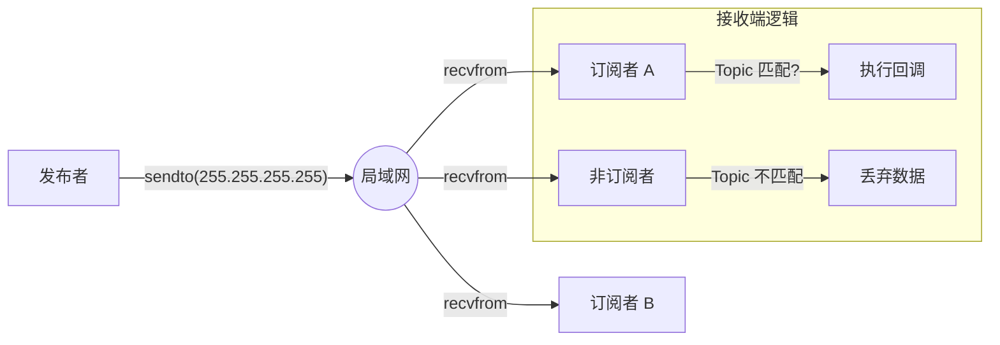

# Simple Middleware (通信中间件)

`simple_middleware` 是本项目的通信骨架，它提供了一个轻量级、去中心化的发布/订阅 (Pub/Sub) 机制。它的设计目标是模拟 ROS 2 / CyberRT 的核心通信体验，但底层实现保持极致简单（基于 UDP 广播）。

## 1. 架构原理

该中间件采用了 **UDP 广播 (Broadcast)** 模式来实现“软总线”。

### 核心特性

- **无 Broker**: 没有中心转发节点，所有节点对等
- **全网广播**: 消息发往 `255.255.255.255`，局域网内所有节点都能收到
- **端口复用**: 利用 `SO_REUSEPORT`，所有模块监听同一个端口 (`12345`)
- **话题过滤**: 接收端在应用层根据 Topic 字符串进行过滤

### 数据流图



## 2. 代码结构

| 文件                         | 描述                                                         |
| :--------------------------- | :----------------------------------------------------------- |
| **`pub_sub_middleware.hpp`** | 核心类。单例模式，管理 UDP Socket 和接收线程。               |
| **`data_publisher.hpp`**     | 泛型封装。提供类似 ROS 的 `Publisher<T>` 接口 (未完全实装)。 |
| **`status_reporter.hpp`**    | 工具类。用于节点向 Daemon 汇报心跳和状态。                   |
| **`config_manager.hpp`**     | 配置类。负责解析 `config/*.json` 文件。                      |
| **`logger.hpp`**             | 日志工具。提供简单的控制台/文件日志。                        |

## 3. 使用示例

### 发布消息 (Publisher)

```cpp
#include "simple_middleware/pub_sub_middleware.hpp"

void SendData() {
    auto& middleware = simple_middleware::PubSubMiddleware::getInstance();

    std::string topic = "test/topic";
    std::string payload = "{ \"data\": 123 }";

    middleware.publish(topic, payload);
}
```

### 订阅消息 (Subscriber)

```cpp
#include "simple_middleware/pub_sub_middleware.hpp"

void Init() {
    auto& middleware = simple_middleware::PubSubMiddleware::getInstance();

    middleware.subscribe("test/topic", [](const simple_middleware::Message& msg) {
        std::cout << "收到数据: " << msg.data << std::endl;
    });
}
```

## 4. 协议细节 (Wire Protocol)

底层 UDP 数据包的二进制格式非常简单：

| 字段          | 长度   | 说明                                           |
| :------------ | :----- | :--------------------------------------------- |
| **Topic**     | 变长   | 话题字符串，例如 "visualizer/data"             |
| **Separator** | 1 字节 | 空字符 `\0`，用于分隔 Topic 和 Payload         |
| **Payload**   | 变长   | 实际的数据内容 (Protobuf 二进制或 JSON 字符串) |

## 5. 局限性

- **流量浪费**: 即使模块不关心某些消息，底层网卡和 OS 依然会处理这些 UDP 包（广播特性）。
- **可靠性**: UDP 传输不可靠，可能丢包或乱序。
- **安全性**: 局域网内任何设备都可以发送伪造消息。
