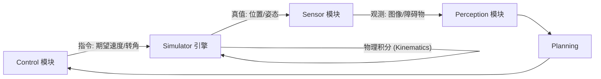
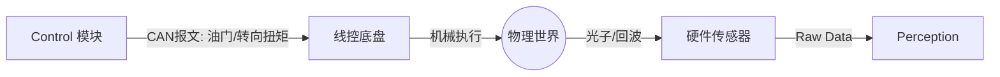

# Simple Simulator (仿真引擎)

`simple_simulator` 是本项目的核心模块之一，它扮演了“虚拟物理世界”的角色。在没有真实车辆和传感器的情况下，它负责维护世界真值（Ground Truth）并进行物理仿真。

## 🧠 核心理念

在自动驾驶开发中，仿真器通常分为两类：

1.  **World Sim (世界模拟器)**: 模拟交通流、天气、车辆动力学。
2.  **Sensor Sim (传感器模拟器)**: 基于 World Sim 的状态，渲染出相机图像、点云等。

本项目中的 `simple_simulator` 是一个简化的 **World Sim**，它负责计算车辆的运动学积分（$P_{t+1} = P_t + V_t \cdot \Delta t$）。而 `simple_sensor` 则承担了部分 **Sensor Sim** 的职责（基于真值生成观测数据）。

## 🏗️ 架构对比：仿真 vs 实车

理解仿真架构与实车架构的区别，是理解本模块存在的关键。

### 1. 仿真架构 (本项目)

这是一个**数学闭环**。Control 模块发出的不是电信号，而是“期望”。

- **特点**: `Control` 模块**不**维护车辆位置，只负责计算控制量。`Simulator` 是唯一的真值来源。

### 2. 实车架构 (Real World)

在真实世界中，没有一个软件模块叫 `Simulator`，“物理世界”本身就是处理器。

- **区别**: 实车上，Control 发出的指令通过 CAN 总线控制电机；车辆的运动是物理定律自然发生的，而不是代码算出来的。

### 3. 无缝迁移方案 (SIL/HIL Ready)

得益于当前的解耦架构，本系统的核心算法模块（Planning, Control）可以在**不修改任何代码**的情况下迁移到实车。

- **核心层不变**: `Control` 模块只关心 `State` (输入) 和 `Command` (输出)。它并不关心 State 是来自模拟器的积分公式，还是来自真实的 GPS/IMU。
- **驱动层适配**:
  - **仿真模式**: `Simulator` 充当驱动，提供虚拟 State，接收虚拟 Command。
  - **实车模式**:
    - 编写 `GNSS/IMU Driver` 替代 Simulator 发布 `visualizer/data` (State)。
    - 编写 `CANBus Interface` 替代 Simulator 订阅 `control/command` (Command)。

这种架构被称为 **Software-in-the-Loop (SIL)**，是工业界开发自动驾驶系统的标准范式。此次引入 `simple_simulator`，标志着本项目从“玩具 Demo”向“工程级架构”迈出了关键一步。

## 🔄 数据流转 (Data Pipeline)

在 `simple_simulator` 运行时的详细数据流：

1.  **Input (输入)**:

    - 订阅 `control/command` (来自 `simple_control`)。
    - 包含：`target_speed` (模拟油门), `target_steering` (模拟方向盘)。

2.  **Process (处理 - Physics Loop)**:

    - 运行频率：**100Hz**。
    - **动力学模拟**: 使用一阶滞后模型模拟车辆加速过程（车速不会突变）。
    - **运动学模拟**: 使用 **Bicycle Model (单车模型)** 进行积分：
      $$
      \begin{aligned}
      \dot{x} &= v \cos(\psi) \\
      \dot{y} &= v \sin(\psi) \\
      \dot{\psi} &= \frac{v}{L} \tan(\delta)
      \end{aligned}
      $$
    - 更新车辆的全局坐标 $(x, y, \psi)$。

3.  **Output (输出)**:
    - 发布 `visualizer/data` (为了兼容性，沿用了这个 Topic 名)。
    - 内容：`FrameData`，包含车辆位姿、真值障碍物列表。
    - **消费者**:
      - `simple_sensor`: 用真值来模拟传感器观测。
      - `simple_visualizer`: 用真值来渲染上帝视角的车辆位置。
      - `simple_control`: 用真值作为反馈（Feedback）来计算下一帧的 PID 误差。

## 🛠️ 代码结构

- `simulator_core.hpp/cpp`: 核心逻辑类。
  - `StepPhysics(dt)`: 执行物理步进。
  - `InitScenario()`: 初始化静态场景（放置假车、锥桶）。
- `main.cpp`: 程序入口，负责信号处理。

## ⚠️ 局限性

目前的仿真器非常基础：

1.  **无碰撞检测**: 车撞到障碍物会直接穿过去。
2.  **简单动力学**: 没有考虑轮胎侧滑、摩擦力、质量转移等复杂物理特性。
3.  **静态场景**: 目前障碍物是写死的，不会动（虽然架构上支持动态障碍物）。
